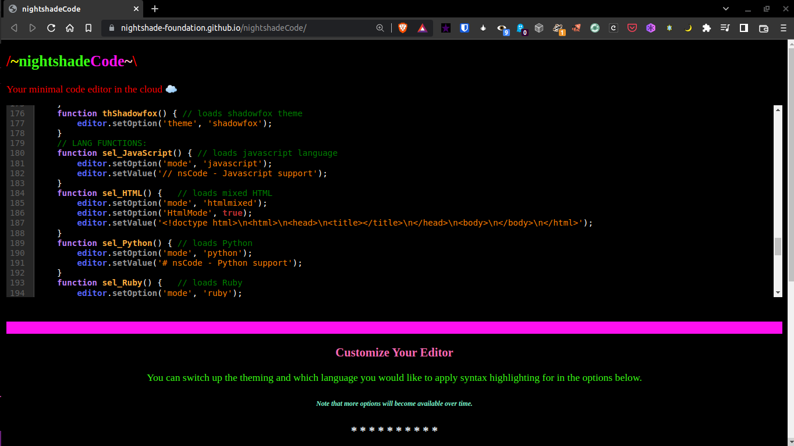
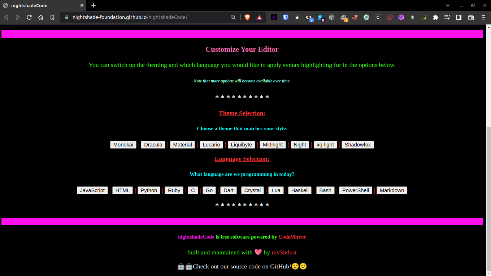

# nightshadeCode
A simple, minimal code editor that you can use in the cloud. Powered by [CodeMirror](https://codemirror.net).

###### nightshadeCode's text editor.

**nightshadeCode** is now live on GH Pages - visit it [here](https://nightshade-foundation.github.io/nightshadeCode/) and get to programming in the cloud!

### What Does nightshadeCode Do? 

It is a simple webpage that allows anyone to write code without needing to download a lot of things to their local computer. Don't have access to your IDE, or just want to code up a quick concept? This is a great place for you to do it, without the need to worry about downloading development software and the like. 

### nightshadeCode Current Features

###### nightshadeCode's currently supported themes and languages. 

Currently, **nightshadeCode** features several nice-looking themes for you to choose from, and a good deal of supported programming and markup languages, including: 

- **JavaScript**
- **HTML/CSS/XML**
- **Python**
- **Ruby**
- **C**
- **Go**
- **Dart**
- **Crystal**
- **Lua**
- **Haskell**
- **Bash**
- **PowerShell**
- **Markdown**

*We're going to be adding more languages and themes over time - so if you would like support for something not already listed, please let us know, or better yet, __open a pull request__!* 

### Future Plans

There are several future ideas we would like to implement into **nightshadeCode**, including the ability to save and load files, bring in support for more languages and themes, autocorrect/hinting support for more languages, and more. These are just a few of the ideas that we'd love to bring into this project, and we will be sure to update this Readme if anything new is implemented.
